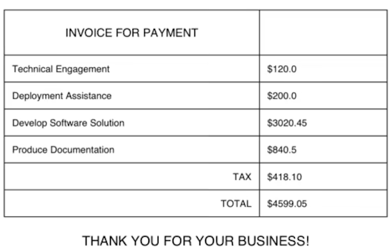

# Create a Pdf file in flutter

## Configuration de l'environnement de développement flutter pour produire des pdf

- configuration de notre pubspec.yml : ajouter le pdf package pour la prodution de pdf, le printing package pour prévisualiser le pdf que nous produisons.

```python
dependencies:
  flutter:
    sdk: flutter


  # The following adds the Cupertino Icons font to your application.
  # Use with the CupertinoIcons class for iOS style icons.
  cupertino_icons: ^1.0.2
  pdf: ## add this
  printing: ## also add this
```

- Configurer notre modèle pour les factures :pour cela créons notre modèle de données ainsi :

```dart
class Invoice {
  final String customer;
  final String address;
  final List<LineItem> items;
  Invoice(this.customer, this.address, this.items);
  double totalCost() {
    return items.fold(0, (previousValue, element) => previousValue + element.cost);
  }
}

class LineItem {
  final String description;
  final double cost;

  LineItem(this.description, this.cost);
}
```

on a notre objet facture qui contient les informations sur le client et les articles. Une fonction qui calcule le montant total de la facture. l'opérateur *.folds* parcourt la liste des produits et calcule le coût total.

- Nous travaillons sur notre interface utilisateur : La page de la liste des factures. Lorsque l'application s'ouvre il doit montrer la liste des factures. nous allons mettre sur pieds un ensemble de données. Pour chaque facture, notre échantillon de données doit inclure le nom et l'adresse du client, le nom de la facture, la liste des servies fournis au client avec les noms et coûts respectifs.

```dart
final invoices = [
  Invoice(
      customer: 'David Thomas',
      address: '123 Fake St\r\nBermuda Triangle',
      items: [
        LineItem(
          'Technical Engagement',
          120,
        ),
        LineItem('Deployment Assistance', 200),
        LineItem('Develop Software Solution', 3020.45),
        LineItem('Produce Documentation', 840.50),
      ],
      name: 'Create and deploy software package'),
  Invoice(
    customer: 'Michael Ambiguous',
    address: '82 Unsure St\r\nBaggle Palace',
    items: [
      LineItem('Professional Advice', 100),
      LineItem('Lunch Bill', 43.55),
      LineItem('Remote Assistance', 50),
    ],
    name: 'Provide remote support after lunch',
  ),
  Invoice(
    customer: 'Marty McDanceFace',
    address: '55 Dancing Parade\r\nDance Place',
    items: [
      LineItem('Program the robots', 400.50),
      LineItem('Find tasteful dance moves for the robots', 80.55),
      LineItem('General quality assurance', 80),
    ],
    name: 'Create software to teach robots how to dance',
  )
];
```

Nous allons créer une vue basique pour afficher les différentes factures

```dart
@override
Widget build(BuildContext context) {
  return Scaffold(
    appBar: AppBar(
      title: Text('Invoices'),
    ),
    body: ListView(
      children: [
        ...invoices.map(
          (e) => ListTile(
            title: Text(e.name),
            subtitle: Text(e.customer),
            trailing: Text('\$${e.totalCost().toStringAsFixed(2)}'),
            onTap: () {
              Navigator.of(context).push(
                MaterialPageRoute(
                  builder: (builder) => DetailPage(invoice: e),
                ),
              );
            },
          ),
        )
      ],
    ),
  );
}
```

Lorsqu'on clique sur une facture nous sommes redirigé sur une interface qui affiche les détails de la facture.
- L'interface détail

```dart
class DetailPage extends StatelessWidget {
  final Invoice invoice;
  const DetailPage({
    Key? key,
    required this.invoice,
  }) : super(key: key);

  @override
  Widget build(BuildContext context) {
    return Scaffold(
      floatingActionButton: FloatingActionButton(
        onPressed: () {
          Navigator.of(context).push(
            MaterialPageRoute(
              builder: (context) => PdfPreviewPage(invoice: invoice),
            ),
          );
          // rootBundle.
        },
        child: Icon(Icons.picture_as_pdf),
      ),
      appBar: AppBar(
        title: Text(invoice.name),
      ),
      body: ListView(
        children: [
          Padding(
            padding: const EdgeInsets.all(15.0),
            child: Card(
              child: Row(
                mainAxisAlignment: MainAxisAlignment.spaceBetween,
                children: [
                  Expanded(
                    child: Text(
                      'Customer',
                      style: Theme.of(context).textTheme.headline5,
                    ),
                  ),
                  Expanded(
                    child: Text(
                      invoice.customer,
                      style: Theme.of(context).textTheme.headline4,
                      textAlign: TextAlign.center,
                    ),
                  ),
                ],
              ),
            ),
          ),
          Padding(
            padding: const EdgeInsets.all(15.0),
            child: Card(
              child: Column(
                children: [
                  Text(
                    'Invoice Items',
                    style: Theme.of(context).textTheme.headline6,
                  ),
                  ...invoice.items.map(
                    (e) => ListTile(
                      title: Text(e.description),
                      trailing: Text(
                        e.cost.toStringAsFixed(2),
                      ),
                    ),
                  ),
                  DefaultTextStyle.merge(
                    style: Theme.of(context).textTheme.headline4,
                    child: Row(
                      mainAxisAlignment: MainAxisAlignment.spaceAround,
                      children: [
                        Text("Total"),
                        Text(
                          invoice.totalCost().toStringAsFixed(2),
                        ),
                      ],
                    ),
                  )
                ],
              ),
            ),
          ),
        ],
      ),
    );
  }
}
```
  
## ajouter des éléments au pdf sur flutter

pour le pdf nous devons nous rassurer  que les éléments suivants soient inclus:
- les informations à propos du client
- le logo de la compagnie
- la liste des d=services qui ont été pourvus
- un prix final
- les détails du paiements, ou les informations que la ompagnie a besoin pour mettre sur pied la facture.

Pour créer un pdf, nous allons créer un nouvea fichier*pdfexport*. notre casse va exposer une seule fonction qui retourne les données binaires du fichier pdf créé. Créons la fonction *makePdf* qui prend en paramètre un *Invoice*. Ensuite nous allons construire l'enveloppe de notre document PDF en déclarant notre objet Document, en ajoutant une page et en ajoutant une colonne à la page.

```dart
Future<Uint8List> makePdf(Invoice invoice) async {
  final pdf = Document();
  pdf.addPage(
    Page(
    build: (context) {
      return Column(
        children: []
      }
    );
}
```


### Créer une adresse et un logo

La première ligne de la facture contient les informations du client et le logo.

Nous allons ajouter des morceaux individuels d'informations à cette page. Parce que la première ligne contient le logo de notre compagnie, nous aurons besoins d'ajouter une reférence dans notre *pubspec.yaml*
>assets:
   - assets/technical_logo.png

Aller dans la fonction makePdf, nous devons maintenant charger le logo depuis les actifs pour l'afficher dans notre PDF.

```dart
final imageLogo = MemoryImage((await rootBundle.load('assets/logo.png')).buffer.asUint8List());
```

Avec ces informations, nous pouvons créer notre première ligne pour contenir les informations de notre client et le logo de la compagnie.

```dart
Row(
  mainAxisAlignment: MainAxisAlignment.spaceBetween,
  children: [
    Column(
      children: [
        Text("Attention to: ${invoice.customer}"),
        Text(invoice.address),
      ],
      crossAxisAlignment: CrossAxisAlignment.start,
    ),
    SizedBox(
      height: 150,
      width: 150,
      child: Image(imageLogo),
    )
  ],
),
```

### Création de la table de facture

la table de la facture doit présenter la liste des services, les prix individuels. De manière claire et ergonomique

```dart
Widget PaddedText(
  final String text, {
  final TextAlign align = TextAlign.left,
}) =>
    Padding(
      padding: EdgeInsets.all(10),
      child: Text(
        text,
        textAlign: align,
      ),
    );
```

Nous pouvons utiliser un tableau dans le paquet pdf pour structurer les données sous forme de tableau.

```dart
Table(
  border: TableBorder.all(color: PdfColors.black),
  children: [
   // The first row just contains a phrase 'INVOICE FOR PAYMENT'
    TableRow(
      children: [
        Padding(
          child: Text(
            'INVOICE FOR PAYMENT',
            style: Theme.of(context).header4,
            textAlign: TextAlign.center,
          ),
          padding: EdgeInsets.all(20),
        ),
      ],
    ),
    // The remaining rows contain each item from the invoice, and uses the
    // map operator (the ...) to include these items in the list
    ...invoice.items.map(
    // Each new line item for the invoice should be rendered on a new TableRow
      (e) => TableRow(
        children: [
          // We can use an Expanded widget, and use the flex parameter to specify
          // how wide this particular widget should be. With a flex parameter of
          // 2, the description widget will be 66% of the available width.
          Expanded(
            child: PaddedText(e.description),
            flex: 2,
          ),
          // Again, with a flex parameter of 1, the cost widget will be 33% of the
          // available width.
          Expanded(
            child: PaddedText("\$${e.cost}"),
            flex: 1,
          )
        ],
      ),
    ),
    // After the itemized breakdown of costs, show the tax amount for this invoice
    // In this case, it's just 10% of the invoice amount
    TableRow(
      children: [
        PaddedText('TAX', align: TextAlign.right),
        PaddedText('\$${(invoice.totalCost() * 0.1).toStringAsFixed(2)}'),
      ],
    ),
    // Show the total 
    TableRow(
      children: [
        PaddedText('TOTAL', align: TextAlign.right),
        PaddedText("\$${invoice.totalCost()}"),
      ],
    )
  ],
),
Padding(
  child: Text(
    "THANK YOU FOR YOUR BUSINESS!",
    style: Theme.of(context).header2,
  ),
  padding: EdgeInsets.all(20),
),
```
Le résultat est:


### Création du bulletin de paiement

Ligne de points pour séparer le premier tableau et un autre tableaupour montrer les informations du compte.

```dart
Text("Please forward the below slip to your accounts payable department."),
// Create a divider that is 1 unit high and make the appearance of
// the line dashed
Divider(
  height: 1,
  borderStyle: BorderStyle.dashed,
),
// Space out the invoice appropriately
Container(height: 50),
// Create another table with the payment details
Table(
  border: TableBorder.all(color: PdfColors.black),
  children: [
    TableRow(
      children: [
        PaddedText('Account Number'),
        PaddedText(
          '1234 1234',
        )
      ],
    ),
    TableRow(
      children: [
        PaddedText(
          'Kengne Zida',
        ),
        PaddedText(
          'Talom FAMILY TRUST',
        )
      ],
    ),
    TableRow(
      children: [
        PaddedText(
          'Total Amount to be Paid',
        ),
        PaddedText('\$${(invoice.totalCost() * 1.1).toStringAsFixed(2)}')
      ],
    )
  ],
),
// Add a final instruction about how checks should be created
// Center align and italicize this text to draw the reader's attention
// to it.
Padding(
  padding: EdgeInsets.all(30),
  child: Text(
    'Please ensure all checks are payable to the ADAM FAMILY TRUST.',
    style: Theme.of(context).header3.copyWith(
          fontStyle: FontStyle.italic,
        ),
    textAlign: TextAlign.center,
  ),
)
```

Enfin, à la fin de notre fonction *makePdf*, nous devons aussi retourner le pdf généré.

> return pdf.save();

Une dernière chose est de créer une interface pour prévisualiser le pdf.

```dart
class PdfPreviewPage extends StatelessWidget {
  final Invoice invoice;
  const PdfPreviewPage({Key? key, required this.invoice}) : super(key: key);

  @override
  Widget build(BuildContext context) {
    return Scaffold(
      appBar: AppBar(
        title: Text('PDF Preview'),
      ),
      body: PdfPreview(
        build: (context) => makePdf(invoice),
      ),
    );
  }
}
```
## Créer une prévisualisation de la page pdf dans flutter

Créer une prévisualisation du pdf est simple lorsqu'on utilise le package *printing*.

[Code source complet](https://github.com/flutterfromscratch/flutter-pdf)

## Code source complet

```dart
import 'dart:typed_data';

import 'package:pdf/pdf.dart';
import 'package:pdf/widgets.dart';
import 'package:flutter/services.dart' show rootBundle;

import '../../../model/invoicemodel.dart';

/*
ici est construit le pdf
*/
Future<Uint8List> makePdf(Invoice invoice, dynamic invoices) async {
  DateTime now = DateTime.now();
  DateTime date = DateTime(now.year, now.month, now.day);
  //création du document
  final pdf = Document();
  //image à ajouetr au pdf
  final imageLogo = MemoryImage(
      (await rootBundle.load('assets/logo1.png')).buffer.asUint8List());

  final tableHeaders = [
    'Description',
    'Quantité',
    'Prix Unit',
    'Total',
  ];

  final tableData = [
    ["Mathématique Sil", '2000 XAF', '1', '2000 XAF'],
    ['Biologie', '3000 XAF', '3 ', '9000 XAF'],
    ["Mathématique Sil", '2000 XAF', '1 ', '2000 XAF'],
    ['Biologie', '3000 XAF', '3 ', '9000 XAF'],
    ["Connaissance de la langue Anglaise", "1000 XAF", "3", "3000 XAF"],
    ["Formation à l'utilisation de word", "500 XAF", "3", "1500 XAF"]
  ];

  pdf.addPage(MultiPage(build: (context) {
    return [
      //l'en têtede la page
      Row(
        children: [
          SizedBox(
            height: 72,
            width: 72,
            child: Image(imageLogo),
          ),
          SizedBox(width: 1 * PdfPageFormat.mm),
          Column(
            mainAxisSize: MainAxisSize.min,
            crossAxisAlignment: CrossAxisAlignment.start,
            children: [
              Text(
                'Facture',
                style: TextStyle(
                  fontSize: 17.0,
                  fontWeight: FontWeight.bold,
                ),
              ),
              Text(
                '',
                style: const TextStyle(
                  fontSize: 15.0,
                  color: PdfColors.grey700,
                ),
              ),
            ],
          ),
          Spacer(),
          Column(
            mainAxisSize: MainAxisSize.min,
            crossAxisAlignment: CrossAxisAlignment.start,
            children: [
              Text(
                'Noutcha Ngapi J.',
                style: TextStyle(
                  fontSize: 15.5,
                  fontWeight: FontWeight.bold,
                ),
              ),
              Text(
                'jonathan@gmail.com',
              ),
              Text(
                "$date",
              ),
            ],
          ),
        ],
      ),
      SizedBox(height: 1 * PdfPageFormat.mm),
      Divider(),
      SizedBox(height: 1 * PdfPageFormat.mm),
      // Texte si nécessaire
      Text(
        '',
        // 'Dear John,\nLorem ipsum dolor sit amet consectetur adipisicing elit. Maxime mollitia, molestiae quas vel sint commodi repudiandae consequuntur voluptatum laborum numquam blanditiis harum quisquam eius sed odit fugiat iusto fuga praesentium optio, eaque rerum! Provident similique accusantium nemo autem. Veritatis obcaecati tenetur iure eius earum ut molestias architecto voluptate aliquam nihil, eveniet aliquid culpa officia aut! Impedit sit sunt quaerat, odit, tenetur error',
        textAlign: TextAlign.justify,
      ),
      SizedBox(height: 5 * PdfPageFormat.mm),
      Container(height: 50),
      //======================================= Tableau des services ================
      //génère le tableau dynamiquement. Il suffit de bien structurer les données d'en tête et de données
      Table.fromTextArray(
        headers: tableHeaders,
        data: tableData,
        border: null,
        headerStyle: TextStyle(fontWeight: FontWeight.bold),
        headerDecoration: const BoxDecoration(color: PdfColors.grey300),
        cellHeight: 30.0,
        cellAlignments: {
          0: Alignment.centerLeft,
          1: Alignment.centerRight,
          2: Alignment.centerRight,
          3: Alignment.centerRight,
        },
      ),
      //=============================================================================
      //============================ l'ensemble des totaux ==========================
      Divider(),
      Container(
        alignment: Alignment.centerRight,
        child: Row(
          children: [
            Spacer(flex: 6),
            Expanded(
              flex: 4,
              child: Column(
                crossAxisAlignment: CrossAxisAlignment.start,
                children: [
                  /*
                        Row(
                          children: [
                            
                            Expanded(
                              child: Text(
                                'Net total',
                                style: TextStyle(
                                  fontWeight: FontWeight.bold,
                                ),
                              ),
                            ),
                            Text(
                              '\$ 464',
                              style: TextStyle(
                                fontWeight: FontWeight.bold,
                              ),
                            ),
                          ],
                        ),
                        Row(
                          children: [
                            Expanded(
                              child: Text(
                                'Vat 19.5 %',
                                style: TextStyle(
                                  fontWeight: FontWeight.bold,
                                ),
                              ),
                            ),
                            Text(
                              '\$ 90.48',
                              style: TextStyle(
                                fontWeight: FontWeight.bold,
                              ),
                            ),
                          ],
                        ),
                        Divider(),
                        */
                  Row(
                    children: [
                      Expanded(
                        child: Text(
                          'Total',
                          style: TextStyle(
                            fontSize: 14.0,
                            fontWeight: FontWeight.bold,
                          ),
                        ),
                      ),
                      Text(
                        '14000 XAF',
                        style: TextStyle(
                          fontWeight: FontWeight.bold,
                        ),
                      ),
                    ],
                  ),
                  SizedBox(height: 2 * PdfPageFormat.mm),
                  Container(height: 1, color: PdfColors.grey400),
                  SizedBox(height: 0.5 * PdfPageFormat.mm),
                  Container(height: 1, color: PdfColors.grey400),
                ],
              ),
            ),
          ],
        ),
      ),
    ];
  },
      //========================================================le pied de page=============================
      footer: (context) {
    return Column(
      mainAxisSize: MainAxisSize.min,
      children: [
        Divider(),
        SizedBox(height: 2 * PdfPageFormat.mm),
        Text(
          '',
          style: TextStyle(fontWeight: FontWeight.bold),
        ),
        SizedBox(height: 1 * PdfPageFormat.mm),
        Row(
          mainAxisAlignment: MainAxisAlignment.center,
          children: [
            Text(
              'Address: ',
              style: TextStyle(fontWeight: FontWeight.bold),
            ),
            Text(
              'Immeuble TECNO, Boulevard de la liberté Akwa, Douala',
            ),
          ],
        ),
        SizedBox(height: 1 * PdfPageFormat.mm),
        Row(
          mainAxisAlignment: MainAxisAlignment.center,
          children: [
            Text(
              'Email: ',
              style: TextStyle(fontWeight: FontWeight.bold),
            ),
            Text(
              'OFTY@ofty.fr',
            ),
          ],
        ),
        SizedBox(height: 1 * PdfPageFormat.mm),
        Row(
          mainAxisAlignment: MainAxisAlignment.center,
          children: [
            Text(
              'Téléphone: ',
              style: TextStyle(fontWeight: FontWeight.bold),
            ),
            Text(
              '(+237) 6801236547',
            ),
          ],
        ),
      ],
    );
  }));
//=========================================================================================================
  return pdf.save();
}
```
## Prévisualisation du pdf généré

Dans le body du scaffold on met  cette fonction qui crée le pdf avec la fonction makePdf.
```dart
PdfPreview(
        build: (context) => makePdf(invoice, invoices),
      ),
```

> Noutcha Ngapi J.,  OFTY Cameroun